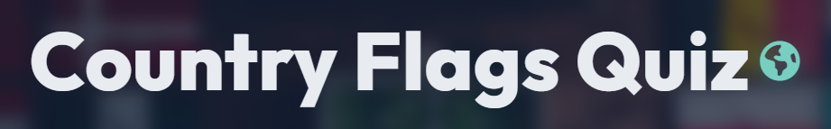

# Country Flags Quiz

Visit the deployed site: [Country Flags Quiz] (https://ieuanpriede.github.io/Country-Flags-Quiz/)

A fun quiz to test your knowledge of country flags from around the world.

Match the flag image to one of the four listed country names.

## CONTENTS

* [User Experience](#user-experience)
  * [User Stories](#user-stories)

* [Design](#design) 
  * [Colour Scheme](#colour-scheme)
  * [Typography](#typography)
  * [Imagery](#imagery)
  * [Wireframes](#wireframes)
  * [Features](#features)
    * [The Home page](#the-home-page)
    * [The 404 Error Page](#the-404-error-page)
  * [Accessibility](#accessibility)

* [Technologies Used](#technologies-used)
  * [Languages Used](#languages-used)
  * [Frameworks, Libraries & Programs Used](#frameworks-libraries--programs-used)

* [Deployment & Local Development](#deployment--local-development)
  * [Deployment](#deployment)
  * [Local Development](#local-development)

* [Testing](#testing)

* [Credits](#credits)

- - -

  

## User Experience

### User Stories

#### First Time Visitor Goals

* I want to test my knowledge of country flags.
* I want to have fun doing something educational.
* I want the site to be responsive to my device.
* I want the site to be easy to navigate.

#### Returning Visitor Goals

* I want to test my knowledge of country flags and learn for those I got incorrect.
* I had fun and want to continue having fun.

#### Frequent Visitor Goals

* I want to master this quiz.
* I want to know all country flags off by heart.

## Design

### Colour Scheme

I chose an image of a map of the world with no labels. This map's colour were simple light blue and white.

* For the container of which the game sits inside I used rgba(2, 1, 0, 0.8).
* For the Heading and Score I used #ffffff.
* For correct answers I used #008000.
* For incorrect answers I used #ff0000.

### Typography

Google Fonts was used to import the chosen fonts for use in the site.

* For the Page Heading I used the google font [Bangers] ('https://fonts.googleapis.com/css2?family=Bangers&family=Cormorant:ital,wght@0,300..700;1,300..700&display=swap')
* For the page content I used the google font [Noto Sans] ('https://fonts.googleapis.com/css2?family=Bangers&family=Cormorant:ital,wght@0,300..700;1,300..700&family=Noto+Sans:ital,wght@0,100..900;1,100..900&display=swap')

### Imagery

For the Background Image I used a map of the world containing no labels.
For the questions I used images of the country flags.

### Wireframes

Wireframes were created for mobile, tablet and desktop using balsamiq.

### Features

The Quiz only contains two pages.

All pages are responsive and have:

* A favicon in the browser tab & the footer.

* The title of the quiz at the top of every page.

#### The Home Page

The home page contains the map image as the background and a container which hold the quiz inside. I has a start button to begin the quiz.

Once the quiz has begun, the flag image appears with four options to choose from. It also shows what question number the user is on, and their score.
It contains a next button to move the user onto the next question, and tells the user if their answer is correct or incorrect.

#### 404 Error Page

The 404 Error Page tells the user that something went wrong. It offer the user a way to return back to the home page with a 'Return' button.

### Accessibility 

I have been mindful during coding to ensure that the website is as accessible friendly as possible. This has been have achieved by:

* Using semantic HTML.
* Ensuring that there is a sufficient colour contrast throughout the site.

## Technologies Used

HTML, CSS, JAVA SCRIPT

### Frameworks, Liraries & Programs Used

## Deployment & Local Development

* [Balsamiq](https://balsamiq.com/) - Used to create wireframes.
* [Github](https://github.com/) - To save and store the files for the website.
* [GitPod](https://gitpod.io/) - IDE used to create the site.
* [Google Fonts](https://fonts.google.com/) - To import the fonts used on the website.
* [Favicon.io](https://favicon.io/) To create favicon.
* [Am I Responsive?](http://ami.responsivedesign.is/) To show the website image on a range of devices.

### Deployment

The site is deployed using GitHub Pages - [Country Flags Quiz](https://ieuanpriede.github.io/Country-Flags-Quiz/)

To Deploy the site using GitHub Pages:

1. Login (or signup) to Github.
2. Go to the repository for this project, [Ieuan-Priede/Country-Flags-Quiz](https://github.com/IeuanPriede/Country-Flags-Quiz).
3. Click the settings button.
4. Select pages in the left hand navigation menu.
5. From the source dropdown select main branch and press save.
6. The site has now been deployed, please note that this process may take a few minutes before the site goes live.

### Local Development

#### How to Fork

To fork the repository:

1. Log in (or sign up) to Github.
2. Go to the repository for this project, [Ieuan-Priede/Country-Flags-Quiz](https://github.com/IeuanPriede/Country-Flags-Quiz).
3. Click the Fork button in the top right corner.

### How to Clone

To clone the repository:

1. Log in (or sign up) to GitHub.
2. Go to the repository for this project, [Ieuan-Priede/Country-Flags-Quiz](https://github.com/IeuanPriede/Country-Flags-Quiz).
3. Click on the code button, select whether you would like to clone with HTTPS, SSH or GitHub CLI and copy the link shown.
4. Open the terminal in your code editor and change the current working directory to the location you want to use for the cloned directory.
5. Type 'git clone' into the terminal and then paste the link you copied in step 3. Press enter.

## Testing

Please refer to [TESTING.md](/TESTING.md) file for all testing carried out.

### Solved Bugs

[Error](assets/images/Image_src_error.png) - Bad value for attribute 'src' - [Fixed](assets/images/src_fix.png)

[Error](assets/images/javascript_test.png) - 1 Unused variable 'maxCount' - [Fixed](assets/images/js_fix.png)

## Credits

### Code Used

* I used the Code Institute curriculum to help with my coding. In particular the 'Love Maths' section.

* I used this [Video Tutorial](https://www.youtube.com/watch?v=riDzcEQbX6k&list=WL&index=3&t=851s&ab_channel=WebDevSimplified) on Youtube by [WebDevSimplified](https://www.youtube.com/@WebDevSimplified) to help with me with the quiz buttons.

* I made use of ChatGPT to help guide me through processes such as implementing images as questions.

### Content

All content for the site were written by myself.

### Media

Background image:

Wikipedia -
[Map](https://en.m.wikipedia.org/wiki/File:A_large_blank_world_map_with_oceans_marked_in_blue.PNG) 

Flags -
All flag images were taken from Wikipedia [Wikipedia](https://www.wikipedia.org/)
 