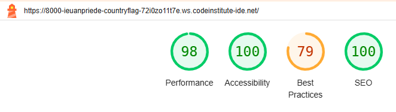

# Country Flags Quiz - Testing

Visit the deployed site: [Country Flags Quiz] (https://ieuanpriede.github.io/Country-Flags-Quiz/)

- - -

## Contents

* [AUTOMATED TESTING](#automated-testing)
  * [W3C Validator](#w3c-validator)
* [MANUAL TESTING](#manual-testing)
  * [Testing User Stories](#testing-user-stories)
  * [Full Testing](#full-testing)  

  Testing was ongoing throughout the entire build. I used the Inspect tool to ensure each page is resposive for different screen sizes, and the Console tool to ensure a function was being implemented. 

   ## AUTOMATED TESTING

  ### W3C Validator

[W3C](https://validator.w3.org/) was used to validate the HTML on all pages of the website. It was also used to validate the CSS.

* [index.html](assets/images/html-test.png) - Passed - 1 (Invalid) [Error](assets/images/Image_src_error.png)
* [404.html](assets/images/404_test.png) - Passed

* [style.css](assets/images/css_test.png) - Passed

### JavaScript Validator

[jshint](https://jshint.com/) I used to validate the JavaScript.

* [script.js](assets/images/javascript_test.png) - Passed. 1 Unused variable = line 15 maxCount. However it is needed to count the number of flags asked, stop and restart the count when quiz has ended.

### Lighthouse

I used Lighthouse within the Chrome Developer Tools to test the performance, accessibility, best practices and SEO of the website.

### Mobile Results

### Desktop Results 

## MANUAL TESTING

### Testing User Stories

`First Time Visitors`

| Goals | How are they achieved? |
| :--- | :--- |
| I want to test my knowledge of country flags. | The Country Flags Quiz offers the user a chance to test their knowledge of country flags. |
| I want to have fun doing something educational. | The quiz is a fun application with a score system |
| I want the site to be responsive to my device. | The Country Flags Quiz site is responsive on all devices |
| I want the site to be easy to navigate. | The Country Flags Quiz site is easy to navigate, with clearly visable buttons allowing the user to select the options they desire. |

`Returning Visitors`

|  Goals | How are they achieved? |
| :--- | :--- |
| I want to test my knowledge of country flags and learn for those I got incorrect. | The quiz tells the user what the correct answer is when the user selects an incorrect answer. |
| I had fun and want to continue having fun. | The quiz gives the user the chance to better their previous score and keeps the user engaged by randomizing the questions and answers. |

`Frequent Visitors`

| Goals | How are they achieved? |
| :--- | :--- |
| I want to master this quiz. | The quiz tells the user what the correct answer is when the user selects an incorrect answer. |
| I want to know all country flags off by heart. | The quiz gives the user the chance to better their previous score and keeps the user engaged by randomizing the questions and answers. |

- - -

### Full Testing

Full testing was performed on the following devices:

* Laptop:
  * Acer, Aspire A715-75G - 1920 x 1080 x 59 hertz
  * Macbook Pro
* Ipad, Tablet:
  * Ipad  
* Mobile Devices:
  * iPhone 12 mini
  

Each device tested the site using the following browsers:

* Google Chrome
* Safari

Tested using Acer, Aspire A715-75G:
* Firefox

Additional testing was taken by friends and family on a variety of devices and screen sizes. They reported no issues while visiting and navigating the site.

`Home Page`

| Feature | Expected Outcome | Testing Performed | Result | Pass/Fail |
| --- | --- | --- | --- | --- |
| Start button | Starts the quiz | Clicked on button | Quiz started | Pass |
| Next button | Takes user to next question | Clicked on button | Next question loads | Pass |
| Options buttons | Selects and answer and tells user if its correct/incorrect | Clicked on button | Option selected, notified if option was correct/incorrect | Pass |
| Restart button | Restarts the quiz, refresing the scores | Clicked on button | Restarted game and refreshed scores | Pass |

`404 Error Page`

| Feature | Expected Outcome | Testing Performed | Result | Pass/Fail |
| --- | --- | --- | --- | --- |
| Return button | Returns user to home page | Clicked on button | Returned to home page | Pass |